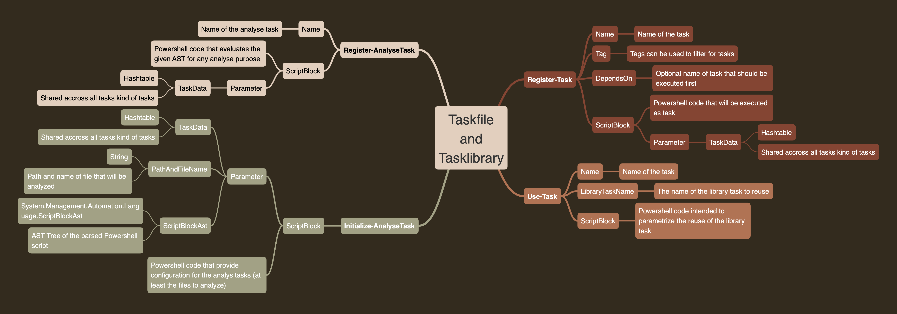

# Library tasks and normal tasks

# Overview

# Normal tasks

Using a normal task file you can use:

 - Initialize-AnalyseTask
 - Register-Task
 - Use-Task
 - Register-AnalyseTask

# Library tasks

For library tasks it is not allowed to use `Use-Task` there.

# Sharing TaskData

The parameter TaskData is shared for all kind of tasks:

 - reserved field `analyseConfiguration` for analyse tasks specific configuration usually a file with multiples names of the analyse tasks and each of them of type hashtable containing limits (of course when you change the limits only)
 - reserved field `analyseResults` being initially an empty list where the analyse results can be added
 - reserved field `privateContext` being used by the `Invoke-Tasks` tool itself

Any other field is free to use. For the `analyseConfiguration` you should define a new name that is not used when defining a new analyse task. The analyse tasks by this repository are documented here: [Static code analysis](static-code-analysis.md)
