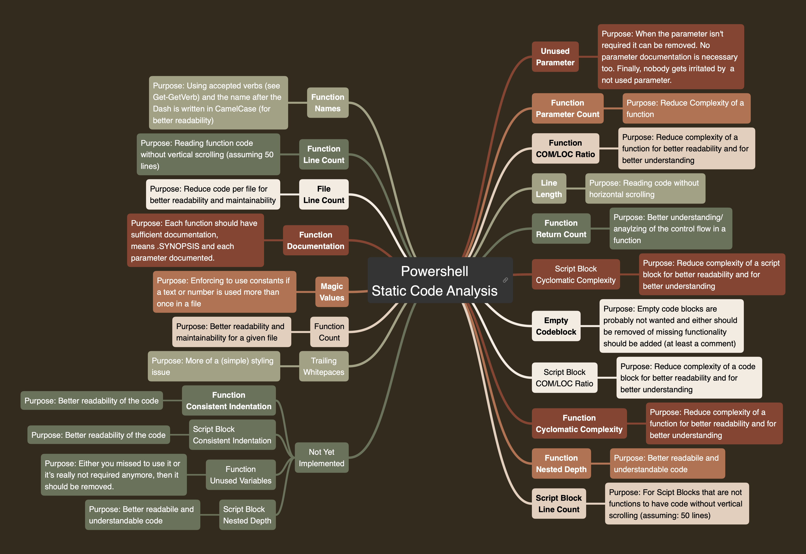

# Static code analysis

## Overview


## Checking for line length

The default is 100. You can change it like following:

```powershell
Initialize-AnalyseTask {
    param ([hashtable] $TaskData)
    $TaskData.analyseConfiguration = @{
        Global = @{
            AnalyzePathAndFileNames = @('./Invoke-Tasks.ps1')
        }
        AnalyzeLineLength = @{
            MaximumLength = 80
        }
        # other settings
    }
}
```
The severity is `information`.

## Checking for count of functions

The default is 20. You can change it like following:

```powershell
Initialize-AnalyseTask {
    param ([hashtable] $TaskData)
    $TaskData.analyseConfiguration = @{
        Global = @{
            AnalyzePathAndFileNames = @('./Invoke-Tasks.ps1')
        }
        AnalyzeFunctionCount = @{
            MaximumCount = 30
        }
        # other settings
    }
}
```
The severity is `information`.

## Checking for line count

The default is 1000. You can change it like following:

```powershell
Initialize-AnalyseTask {
    param ([hashtable] $TaskData)
    $TaskData.analyseConfiguration = @{
        Global = @{
            AnalyzePathAndFileNames = @('./Invoke-Tasks.ps1')
        }
        AnalyzeLineCount = @{
            MaximumCount = 500
        }
        # other settings
    }
}
```
The severity is `information`.

## Checking for function line count

The default is 50. You can change it like following:

```powershell
Initialize-AnalyseTask {
    param ([hashtable] $TaskData)
    $TaskData.analyseConfiguration = @{
        Global = @{
            AnalyzePathAndFileNames = @('./Invoke-Tasks.ps1')
        }
        AnalyzeFunctionLineCount = @{
            MaximumCount = 45
        }
        # other settings
    }
}
```
The severity is `warning`.


## Checking for function parameter count

The default is 5. You can change it like following:

```powershell
Initialize-AnalyseTask {
    param ([hashtable] $TaskData)
    $TaskData.analyseConfiguration = @{
        Global = @{
            AnalyzePathAndFileNames = @('./Invoke-Tasks.ps1')
        }
        AnalyzeFunctionParameterCount = @{
            MaximumCount = 2
        }
        # other settings
    }
}
```
The severity is `warning`.

## Checking for function name

The name should be always like this:

- Using a known verb before the dash like `Initialize` (see Get-Verb)
- The name in CamelCase after the dash like `AnalyseTask` 

You cannot change the verb checking. But you can Change the regex for the name
after the dash like this (showing the default here):

```powershell
Initialize-AnalyseTask {
    param ([hashtable] $TaskData)
    $TaskData.analyseConfiguration = @{
        Global = @{
            AnalyzePathAndFileNames = @('./Invoke-Tasks.ps1')
        }
        AnalyzeFunctionName = @{
            FunctionNameRegex = "^[A-Z][a-z]+([A-Z][a-z]+)*$"
        }
        # other settings
    }
}
```

The severity is `warning`.

## Checking for script block line count

The default is 50. You can change it like following:

```powershell
Initialize-AnalyseTask {
    param ([hashtable] $TaskData)
    $TaskData.analyseConfiguration = @{
        Global = @{
            AnalyzePathAndFileNames = @('./Invoke-Tasks.ps1')
        }
        AnalyzeScriptBlockLineCount = @{
            MaximumCount = 45
        }
        # other settings
    }
}
```
The severity is `warning`.

**Please note**: The limit includes also functions since
a function does have a script block too. The main focus
of course a script block that are not function (eventually
I can filter out those ones later one)

## Checking for function COM/LOC ratio

The default is 0.25. You can change it like following:

```powershell
Initialize-AnalyseTask {
    param ([hashtable] $TaskData)
    $TaskData.analyseConfiguration = @{
        Global = @{
            AnalyzePathAndFileNames = @('./Invoke-Tasks.ps1')
        }
        AnalyzeFunctionComLocRatio = @{
            Ratio = 0.5
        }
        # other settings
    }
}
```
The severity is `warning`. A ratio of 0.25 means 1/4 means one line comment (at least) and three lines of code to keep the ratio. As an example:

```powershell
function Write-Message() {
    param([String] $Message)
    # write information message to console
    Write-Information "Invoke-Tasks :: $Message" -InformationAction Continue
}
```

This function will generate following warning message when the ratio would be adjusted to 0.5:
```
Too less comments 'Write-Message' (1/3=0,33 is below 0,5)
```

## Checking for function unused parameter

There is nothing you can adjust. When a parameter (in a param Block) does
exist but is not used it will be reported. The severity is `warning`.

## Checking for trailing whitepaces

There is nothing you can adjust. When there are trailing whitespaces it will
be reported. The severity is `information`.

## Checking for function documentation

There is nothing you can adjust. The analyse does report:

- missing synopsis (at least this should be provided)
- missing parameter documentation
- documented parameter that is not in the parameter block

The severity is `warning`.

## Checking for magic values

The default is shown in the given example.
You can change it like following:

```powershell
Initialize-AnalyseTask {
    param ([hashtable] $TaskData)
    $TaskData.analyseConfiguration = @{
        Global = @{
            AnalyzePathAndFileNames = @('./Invoke-Tasks.ps1')
        }
        AnalyzeMagicValues = @{
            Excludes = @(0, 1, "`"`"", "`"{0}`"")
        }
        # other settings
    }
}
```

The severity is `warning`.

## Checking for function nested depth

The default is 3. You can change it like following:

```powershell
Initialize-AnalyseTask {
    param ([hashtable] $TaskData)
    $TaskData.analyseConfiguration = @{
        Global = @{
            AnalyzePathAndFileNames = @('./Invoke-Tasks.ps1')
        }
        AnalyzeFunctionNestedDepth = @{
            MaximumDepth = 4
        }
        # other settings
    }
}
```

The severity is `warning`.